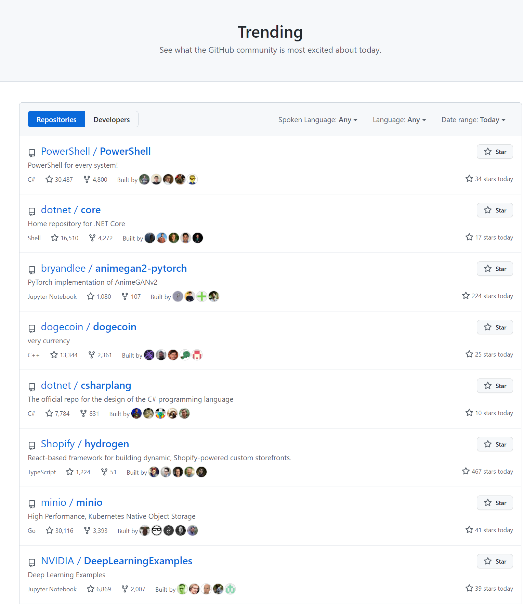

# Haskell-GitHub-Trending
Final project for UCSD CSE230 Fa21

Collaborators:

- Wenzhe Zhang (A59002032)

### Goal

#### Description

GitHub Trending include recent most popular GitHub repositories, and users could click in to see the details of these repositories. Here is a screenshot of the UI of GitHub Trending:

Our goal is to implement a Haskell application to display the trending and repositories, and users could filter these trends by different categories like language, date, etc. and freely `click in` these repositories to see detailed contents.
